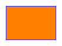
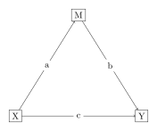
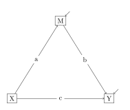
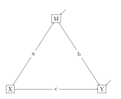
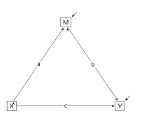
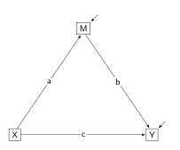
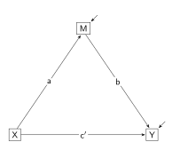
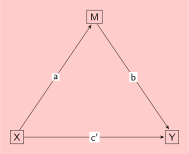

This section provides a quick introduction to the drawing of SEM path diagrams using **Ti*k*Z**, a $\mathsf{\LaTeX}$ package. But first, a warning: I am not an expert, and I am self-taught - I wouldn't be taking advice from me.

To reproduce the diagrams in this tutorial, a LaTeX distribution and a LaTeX editor and compiler need to be installed. I use the [MiKTeX](https://miktex.org) distribution, a Windows distribution, but others include [MacTeX](https:tuh.org/mactex) for Apple and [TeX Live](httpe://tug.org/texlive) for Linux. For editing and compiling, I use a simple text editor, [Notepad++](https://notepad-plus-plus.org/), and compile using the `pdflatex` command in [Git Bash](https://gitforwindows.org/); but I have used both [TeXworks](https://tug.org/texworks/) and [TexStudio]( https://texstudio.org/), editors and compilers in one. All diagrams were compiled using the pdfLaTeX engine. 

Alternatively, [Overleaf](https://overleaf.com), an online LaTeX editor and compiler, can be used. 

The Ti*k*Z manual is available at [https://tikz.dev](https://tikz.dev). There are many texts (and online tutorials) offering introductions and guides to Ti*k*Z. One of my favourites is: 
 
Kottwitz, Stefan. (2023). *LaTeX Graphics with TikZ: A practioner's guide to drawing 2D and 3D images, diagrams, and plots*. Birmingham: Packt Publishing. 

Ti*k*Z generates pdf images. These are vector graphics (unlike raster graphics as used in png and jpeg formats). An advantage of vector graphics is that they are resolution independent; that is, zoom in and there will be no blurry or pixelated images. If the images need to be included in an html document, the pdf format can be converted to svg format, a web-friendly format for displaying vector graphics.

With Ti*k*Z, you need to code. Learning to code Ti*k*Z can be challenging, but for me, the effort was worth it. The graphics generated by Ti*k*Z are precise and consistent. Ti*k*Z is efficient: if there is a need for lines and shapes to have the same styles in a given diagram, or even across diagrams, styles can be set globally, which means there is less need for repetition. Ti*k*Z has an extensive set of libraries: some contain additional and useful features; others contain features to construct special drawings such as shapes, arrowheads, flowcharts; and more.


#### A first Ti*k*Z drawing

Sometimes, Ti*k*Z code can be reasonably intuitive. For instance:

```{tikz}
\draw [blue, thick, fill = orange] (0, 0) rectangle (3, 2);
```

will draw an orange rectangle with a thick blue border, with the bottom left corner at coordinate <span style="white-space: nowrap">(0, 0)</span> and the top right corner at <span style="white-space: nowrap">(3, 2)</span>. Put simply, the `/draw` command needs to know what to draw (a rectangle), and where to draw it (the coordinates). The options (inside square brackets `[]`) describe how to draw the rectangle (orange with a thick blue border). If there are no options, a default rectangle is drawn. The command ends with a semicolon (`;`).

Ti*k*Z is part of the LaTeX system - it is a LaTeX package. All LaTeX programmes, and therefore all Ti*k*Z programmes, contain a preamble section where metadata for the diagram is defined and where LaTeX packages and Ti*k*Z libraries are loaded. In the code below, the preamble does two things. First, it defines the document class (`\documentclass{}`). The `standalone` document class is used. This class creates documents that consist of a single drawing, and reduces the dimensions of the pdf canvas to fit the drawing. The class option (inside the square brackets `[]`) defines a 10 pt border surrounding the diagram. Second, the Ti*k*Z package is loaded. LaTeX packages are usually loaded with `\usepackage{}`, but the `standalone` class, designed for drawings and diagrams only, provides a `tikz` option (inside the square brackets `[]`).  

The document section, following the preamble, is where the document is written. The document must be wrapped in `\begin{document}` and `\end{document}` commands. The document consists solely of the Ti*k*Z diagram. The Ti*k*Z code must be contained within a tikzpicture environment; that is, the Ti*k*Z commands must be wrapped in `\begin{tikzpicture}` and `\end{tikzpicture}` commands. 

The following code, when compiled, will draw an orange rectangle with a thick blue border.


```{tikz}
%| file: "Tutorial1.tex"
```




#### TikZ code to draw a three-variable mediation model

The rectangle is the shape used to signify a manifest (or observed) variable in SEM diagrams, but it is usually the case that the rectangle contains the name of the variable. In TikZ, this is what a node is - text contained within a rectangle, and the rectangle will expand and contract as the length of the text changes. The rectangle is the node's default shape, and thus does not need to be specified. The `\node` command needs the `draw` option (inside square brackets `[]`), otherwise the rectangle will not be drawn. In the code below, three nodes are positioned at the given coordinates, each with a label (X, Y, and M) contained within curly brackets `{}`. Nodes can have names contained within round brackets `()`. It is useful to name the nodes if later constructions use these nodes; for instance, to draw arrows between them. Finally, the rectangles are centered on the given coordinates. Note: in the code below, the node names are (lowercase) x, y, and m; the node labels (which are the variable names) are (uppercase) X, Y, and M. Put simply, the commands instruct the compiler to draw three nodes x, y, and m at the given coordinates. The nodes are rectangles containing the labels X, Y, and M.


```{tikz}
%| file: "Tutorial2.tex"
```


This is beginning to look like a three-variable mediation model. All that is needed now are the arrows; that is, the regressions showing the directions of the causal effects: X to Y for the direct effect; and X to M and M to Y for the indirect effect. The `\draw` commands below instruct the compiler to draw lines (`--`), but the options (`[]`) instruct the compiler to put an arrowhead (`[->]`) at the end of each line. The commands also instruct the compiler between which pairs of nodes to draw the lines; that is, between the named nodes (`(x) -- (y)`, `(x) -- (m)`, and `(m) -- (y)`). Another node is drawn on each of the lines (`(x) -- node {c} (y)`). These are the regression coefficients. The new nodes (`node {c}`, `node {a}`, and `node {b}`) have no names, and no rectangles are drawn - just the labels (c, a, and b); but these nodes need a white background (`fill = white` in their options `(x) -- node[fill = white] {c} (y)`) otherwise the lines will pass through the labels.


```{tikz}
%| file: "Tutorial3.tex"
```




Residuals for M and Y can be included in the model diagram. There are alternatives for representing residuals. Here, a residual is represented by an arrow angled into the variable (the variance of the residual is implied). Two nodes (no rectangles and no labels, just names - e1 and e2) are positioned above and to the right of m and y, then arrows are drawn from these nodes to y and m (`(e1) -- (y)` and `(e2) -- (m)`). 


```{tikz}
%| file: "Tutorial4.tex"
```




#### Modifying the style of programming

Changes are made to the Ti*k*z code that hopefully will make the coding a little more streamlined: an easier method to position the nodes; getting Ti*k*Z to calculate coordinates; a simpler syntax to add labels to the nodes on lines; and the style syntax to define styles globally. Some of these changes involve the use of Ti*k*Z libraries.

The first change is trivial. Default coordinates are (0, 0), and so the coordinates for the first node can be dropped.

Second, looking at the code in the last example, it should be evident that the use of absolute coordinates could become cumbersome, especially as the number of variables increases. The `positioning` library allows nodes to be positioned relative to already positioned nodes (for instance, `right = 5cm of x` or `above right = 4mm of m`). TikZ libraries are loaded with `\usetikzlibrary{}` in the preamble.

Third, consider the position of node m in the diagram: it is above the midpoint of nodes x and y. Using the `calc` library, Ti*k*Z will calculate the coordinates of the midpoint - `$(x) !0.5! (y)$`. The whole command is wrapped in `$` symbols to indicate calculations are involved. The calculations involve the coordinates for nodes x and y: calculate the coordinates for the point halfway (`!0.5!`) between x and y. Node m is then positioned 4 cm above this midpoint using `above = 4cm of $(x) !0.5! (y)$`.

Fourth, `edge` syntax will be used to draw lines; that is, `(x) edge (y)` is used in place of `(x) -- (y)`. Edges can take labels just as lines did, but the `quotes` library offers a simpler syntax: `(x) edge ["c"] (y)` will add the label c to the edge. However, the labels now need two options to get the labels into the lines as before: `(x) edge ["c" {anchor = center, fill = white}] (y)`. 

Fifth, to avoid having to repeat the options in each of the edge quotes, a global change to apply to all edge quotes is made, using styles. (There is the additional benefit of needing only one option: `fill = white` - I don't know why `anchor = center` is no longer needed.) The syntax is `every edge quotes/.style = {fill = white}`. For now, styles are defined in `\tikzset{}` command in the preamble.


```{tikz}
%| file: "Tutorial5.tex"
```




#### Some personal preferences

The diagram works well as it stands, but there are changes - personal preferences - to make for a more pleasing diagram.

First, I prefer a sans sarif font for text in my diagrams. The default text font is changed to sans serif using `\renewcommand{\familydefault}{\sfdefault}` in the preamble.

Second, I like to put comments into my code. Anything after a `%` is treated as a comment. There are three main sections in the code: position the manifest variables; draw regressions between pairs of variables; and draw the residuals. As a consequence, these sections will begin with the comments: `%% Manifest`, `%% Regressions`, and `%% Residuals`.

Third, Ti*k*Z does a reasonable job working out angles for the regression arrows to enter and leave the manifest variables, but there are times when I want to specify the angles. For instance, I can instruct the residual arrows to enter the y node (i.e., the Y variable) at the `north east` corner - `(e1) edge (y.north east)`.  I can precisely specify the angles for the regression lines between pairs of manifest variables using degress; for instance, to draw a line to leave x at 70$^\circ$ and to enter m at 250$^\circ$,  use `(x.70) edge ["a"] (m.250)`.

Fourth, the `arrows.meta` library has an extensive selection of arrowheads and arrow styles. I prefer the filled Stealth arrowhead, a little longer than default. I change the arrow option from `->` to `-{Stealth[length = 1.5mm]}`.

Fifth, the previous change means a lot of extra typing - five regression lines, each needing the Stealth arrowhead. If I specify the Stealth arrowhead as a style, I need make the change once only. I define a `regression` style and add it to the `\tikzset{}` command - `regression/.style = {-{Stealth[length = 1.5mm]}}`. To use the `regression` style in the \draw commands, I replace the arrow option (`->`) in the `\draw` commands with `regression`.

I also want the arrowheads to end just short of the variable. The option is `shorten > = 1pt`, and that is added to the `regression` style.

Sixth, the gap surrounding the regression coefficient labels is too large. I can reduce the gap using `inner sep`, the space between the edge quote and the rectangle, albeit invisible - `inner sep = 1.5pt`. That too is added to the `regression` style.


```{tikz}
%| file: "Tutorial6.tex"
```




This looks good except for the extra arrowheads! They are to do with [strange things happening](https://tex.stackexchange.com/questions/15567/strange-arrow-mark-with-tikz-edge-and-anchors) when using `\draw[->]` and `edge` together. When using `edge` it is preferable to use `\path` (the `\path` command sets up a path without drawing it, but `edge` has a built-in `draw`). Thus the solution is simple - replace `\draw` with `\path`. Also, there is no need for the separate `\path [regression]` commands. Several edges with their embedded quotes can be drawn in a single `\path` command. 


```{tikz}
%| file: "Tutorial7.tex"
```




One final point. When representing mediation models, c is usually reserved to represent the total X-on-Y effect (i.e., the direct effect plus the indirect effect). The direct path (X to Y) is represented by <span style="white-space: nowrap">c$'$</span>. With the default text font, neither the prime symbol nor the single quote is satisfactory, but in maths-mode (i.e., when typesetting mathematical symbols), the single quote works well. To enter maths-mode, surround the mathematical expression with `$` signs - the `c` label becomes `c$'$`. (There is an alternative: `c$^\prime$`. There are some [subtle differences](https://tex.stackexchange.com/questions/87134/what-is-the-advantage-of-using-f-prime-instead-of-f) between `c$'$` and `c$^\prime$`, but nothing to concern me here.)


```{tikz}
%| file: "Tutorial8.tex"
```




#### What if the background is not white

For most diagrams, `fill = white` in the style for edge quotes will be fine. However, if the background colour is not white, the result will be awkward. Consider the following image and its code in which the page colour is set to `red!20` (see the 4th line of code). 


```{tikz}
%| file: "Tutorial9.tex"
```




In situations where the page colour is a uniform colour, and the colour is known, simply change the fill colour in the edge quotes style to match the page colour:

```{tikz}
every edge quotes/.style = {fill = red!20}
```

For complex background colours, another solution is called for. Consider the image below. The background colour is a jpg image of "old paper". The code to draw the background follows the comment, `%% Old paper background`. (This code was taken from a StackExchange question, [Background under a tikzpicture](https://tex.stackexchange.com/questions/524765/background-under-a-tikzpicture), and its answers.)


```{tikz}
%| file: "Tutorial10.tex"
```


Because it is no longer relevant, the edge quotes style is dropped, but the important changes are in the `%% Regressions` section. Instead of one set of commands, there are now two. The first set positions named nodes (i.e., the regression coefficients, `c'`, `a`, and `b`) at the midpoints of the relevant variables. They allow the background to appear through them. The second set positions the arrows, but each is in two sections: a line from the first variable to the coefficient, then an arrow (i.e., `regression`) from the coefficient to the second variable; thus there is a gap in the line.


```{r}
```
