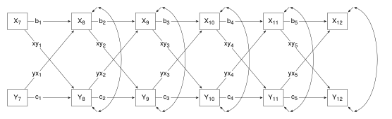
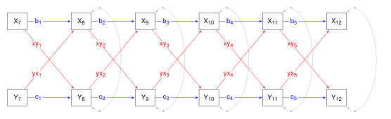

This section demonstrates the use of `\foreach` loops to repeat drawing actions. At the end of this section the path diagram for a cross-lagged panel model is drawn, with a `\foreach` loop drawing repeated elements - the longitudinal measures, stability and cross-lagged effects, residuals, and the covariances between time-specific residuals. 

In a `\foreach` loop, a variable takes on each value in turn from a list of values, repeating code using that variable. For instance, in the following code, the variable `\i` takes on the values 1 through to 6 in turn. The loop passes through the `\node` command six times, drawing nodes with names y1 through to y6, at coordinates (1, 0) through to (6, 0), with labels Y$\mathsf{_1}$ through to Y$\mathsf{_6}$  


```{tikz}
%| file: "Long1.tex"
```


Suppose the Y variables are a measure taken once a year from Grade 7 through to Grade 12. It makes sense that the labels be Y$\mathsf{_7}$ through to Y$\mathsf{_{12}}$; also the nodes need to be spaced out - the x-coordinates can be 0, 3, 6, 9, 12, 15. Loops can take several variables and lists of values. In the code below, there are two variables `\i` and `\j` separated by a forward slash. The first variable, `\i` takes on the year level values, and the second, `\j` takes on the x-coordinate values. Note the curly brackets around `\i` in the label specification, `{$Y_{\i}$}` - the curly brackets ensure all digits appear as subsrcipt.


```{tikz}
%| file: "Long2.tex"
```


Grade can be calculated given x-coordinates of 0, 3, 6, 9, 12, 15: &nbsp;&nbsp;&nbsp; $\small{\mathsf{grade = X/3 + 7}}$ &nbsp;&nbsp;&nbsp; Thus, a one-variable loop can be used, with x-coordinates in the list of values, and `\grade` calculated each time through the loop. I use the `\tikzmath{}` command from the `math` library for these calculations - it has a slightly simpler syntax. (The `math` library is added to the list of libraries loaded with `\usetikzlibrary` in SEMstyles.tex.) Note `int` in the `\tikzmath` command. This ensures an integer is returned; otherwise a decimal with trailing zeros will be returned, and the trailing zeros will appear in the node labels.


```{tikz}
%| file: "Long3.tex"
```


Of course, it is possible to do this the other way round - grades in the list of values, then calculate the x-coordinates in the `\tikzmath` command.


```{tikz}
%| file: "Long4.tex"
```


However, all of these scripts use absolate coordinates to position the nodes. I prefer relative positioning - the current node is positioned to the right of the previous node. The trick is to 'remember' the last node positioned when positioning the current node. A `\foreach` loop can take options (inside square brackets), and one of these options is `remember`. The syntax is:


```{tikz}
\foreach \i [remember = \i as \lasti (initially 1) {2, 3, 4, 5, 6} {<commands>}
```

The command instructs the compiler to remember `\i` from the previous time through the loop but to give it its own variable, here, `\lasti`; that is, `\lasti` has the value of `\i` from the previous time through the loop. Also, the initial value is set for the first time through the loop. Note that the list of values begins with 2. The first node is pulled out of the loop, and positioned at default coordinated. The node names are y1 through to y6, the grade is calculated (7 through to 12) then used in the node label, and coordinates are no longer needed.


```{tikz}
%| file: "Long5.tex"
```


It is possible to use the full range of values (1 through to 6), but the first node still needs to be treated differently from the remaining nodes.  The `\ifnum` command allows for conditional logic; that is, to determine if a condition is TRUE or FALSE. The syntax is:

```{.plain style="background-color: transparent; border-left: none;"}
  \ifnum <condition>
    <code if true>
  \else
    <code if false>
  \fi
```

For the situation at hand: 

- the first time through the loop (`\ifnum \i = 1` is TRUE), position the node at the default coordinates; 
- for every other time (`\else`), position the node to the right of the previously positioned node; 
- then finish with conditional logic (`\fi`).


```{tikz}
%| file: "Long6.tex"
```


A set of regressions from one node to the next (and rsiduals) will result in a longitudinal model. The regressions are drawn using `\lasti` - a regression arrow is drawn from the previously positioned node to the current node. 


```{tikz}
%| file: "Long8.tex"
```


A second set of measures is added to make the model a bivariate model, with stability effects, cross-lagged effects, residuals, and covariances between time-specific residuals. The first X node is position at the default coordinates, and the first Y node is positioned below the first X node (`\ifnum \i = 1` is TRUE); the the remaining X and Y nodes (`\else`) are positioned to the right of the previously positioned X and Y nodes, and the regressions, residuals and covariances are drawn. Note that the edge quotes (for the stability and cross-lagged effects) are positioned one-quarter of the way along the edge (`pos = 0.25`), otherwise the cross-lagged effects would overlap at the cross-over points and get tangled up with the covariance arrows.


```{tikz}
%| file: "Long9.tex"
```




Some might claim that path diagrams with many variables, arrows, and labels are cluttered (and they would be right), but colour can go a long way towards reducing the appearance of clutter. Colours are added to the options (`[]`) for the paths: blue for stability, red for cross-lagged effects, and grey for residuals and covariances. 


```{tikz}
%| file: "Long10.tex"
```




```{r}
```