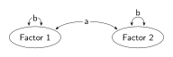

SEM diagrams use a standardised set of shapes and symbols, and in this section, I define styles for those shapes and symbols. They include:

* Rectangles (or squares) to represent manifest (or observed or measured) variables.
* Ellipses (or circles) to represent latent variables (unobserved variables, factors) - variables that are not directly measured. Included are small circles to represent residuals, errors, and disturbances, although, to reduce clutter in complex diagrams, the circles are often omitted.
* Single-headed arrows to represent regression paths. 
* Double-headed arrows on curved lines to represent variances and covariances.
* Triangles to represent the constant so that intercepts and means can be represented. Often, means and intercepts are not modelled, and even when they are, the triangle can be dropped from the model diagram to reduce clutter. 
 
The rectangle and the single-headed arrow were used in the mediation model diagram (see Introduction). In that diagram, two features were set globally: the white fill for edge quotes; and a style for the regression arrow. The `\tikzset{}` command, containing the styles, looked like this:


```{tikz}
\tikzset{
  every edge quotes/.style = {fill = white},
  regression/.style = {-{Stealth[length = 1.5mm]}, shorten > = 1pt, inner sep = 1.5pt}
}
```


In this section, a style for each of the shapes and arrows listed above will be defined. 

In Ti*k*Z, the rectangle and the circle are standard shapes, but it is easier to use the `shapes` library to draw triangles and ellipses, thus the `shapes` library is added to the list of libraries loaded using `\usetikzlibrary{}`.


```{tikz}
\usetikzlibrary{positioning, calc, quotes, arrows.meta, shapes}
```


#### Styles for Manifest and Latent Variables

Styles for mainfest (rectangle) and latent (ellipse) variables are defined: the shape is drawn, minimum dimensions for the node and the size of the `inner sep` are set, and text is centered using `align = center` (needed when variable names take up more than one line of text). The style for `manifest` looks like this:

```{tikz}
manifest/.style = {draw, inner sep = 3pt, align = center, minimum width = 1cm, 
  minimum height = 0.85cm},
```

Note that there is no need to specify `rectangle` because the rectangle is the default node shape. 

The `latent` style is the same as the `manifest` style except it draws an ellipse. I can save some typing by having the `latent` style inherit from the `manifest` style:


```{tikz}
latent/.style = {mainfest, ellipse},
```


At this stage the `\tikzset` command looks like this:


```{tikz}
\tikzset{
  every edge quotes/.style = {fill = white},
  manifest/.style = {draw, inner sep = 3pt, align = center, minimum width = 1cm, 
    minimum height = 0.85cm},
  latent/.style = {manifest, ellipse},
  regression/.style = {-{Stealth[length = 1.5mm]}, shorten > = 1pt, inner sep = 1.5pt}
}
```


#### Styles for Variances and Covariances

The styles for `variance` and `covariance` are defined: they have Stealth arrowheads, the arrows stop one point short of the variable, and `inner sep` is set. I can save some typing by specifying in a separate statement that all arrowheads are Stealth (`> = {Stealth[length = 1.5mm]}`). Similarly, I specify that arrows at both ends stop short of the variable (`shorten > = 1pt, shorten < = 1pt`). The additions to `\tikzset` are:


```{tikz}
> = {Stealth[length = 1.5mm]},
shorten > = 1pt,
shorten < = 1pt,
covariance/.style = {<->, inner sep = 1.5pt},
variance/.style = {<->, inner sep = 0.5pt},
```


I need to modify the `regression` style. The two `shorten` statements mean that both ends of the regression arrow will stop short by one point. To ensure the beginning of the arrow abuts the variable, I override the earlier `shorten` statement with `shorten < = 0pt` in the `regression` style. 

When drawing variances and covariances, the bendiness of the curve needs to be specified. Consider the following contrived model: two latent variables, their variances, and the covariance between them. The `covariance` path contains new elements to specify bendiness.


```{tikz}
\path [covariance] (f1.20) edge [bend left = 40, looseness = 0.7] (f2.160);
``` 


First, f1 and f2 are the names of the two latent variables, and the numbers, `20` and `160`, are the angles with which the arrows leave and enter f1 and f2. 

Second, `bend left` means that the curve bends upwards as it leaves f1. It works like this: imagine a straight line connecting `f1.20` and `f2.160`; as the covariance curve leaves `f1.60` it bends to the left away from the line; that is, upwards. The argument for `bend left`, `40`, means that the curve bends to the left at 40$^\circ$ from the straight line connection between `f1.20` and `f2.160`. 

Third, `looseness` specifies how loose (say, 2.0) or tight (say, 0.2) the bend will be. 

Similarly, the variances specify: the in and out angles of 60$^\circ$ and 120$^\circ$; that when leaving `f1.60` for `f1.120`, the curve bends to the right (i.e, upwards) at 90$^\circ$ from the straight line connection; and that the looseness is set to 2.0.


```{tikz}
\path [variance] (f1.60) edge [bend right = 90, looseness = 2.0] (f1.120);
\path [variance] (f2.60) edge [bend right = 90, looseness = 2.0] (f2.120);
```


Specifying looseness, bend, and the in and out angles can be a bit of an art, and some trial and error is uaually called for. The complete code and diagram follow.


```{tikz}
%| file: "Styles1.tex"
```


There is a good deal of repetition required when drawing variances and covariances. Fortunately, styles can take arguments, and the agruments allow much of the detail to be moved into their styles. Consider an example with one argument, specifying whether the bend is to the left or to the right. The `covariance` style looks like this:


```{tikz}
covariance/.style = {<->, inner sep = 1.5pt, bend #1 = 40, looseness = 0.7}
```


and the command to draw the covariance, with the bend to the left, looks like this:


```{tikz}
\path [covariance = {left}] (f1.20) edge (f2.160);
```


That is, `#1` in the style represents the argument, and `covariance = {left}` in the command sets the value `left` to `#1`.

In addition to the bend, arguments can be set for the angle of the bend and the looseness - requiring three arguments. With three arguments (or more), the number of arguments is specified with `n args = {}`, and `#1`, `#2`, and `#3` represent the three arguments. The `covariance` style becomes:


```{tikz}
covariance/.style n args = {3}{<->, inner sep = 1.5pt, bend #1 = #2, looseness = #3}
```


and the command to draw the covariance becomes:


```{tikz}
\path [covariance = {left}{40}{0.7}] (f1.20) edge (f2.160);
```


so that the value `left` is set to `#1`, the value `40` is set to `#2`, and the value `0.7` is set to `#3`. In this way, differing bends, angles of the bend, and loosenesses can be set for the same style. 

The `variance` style has the same three arguments as the `covariance` style. Indeed the only difference between the two styles is in the size of the inner sep, and thus it makes sense to have the `variance` style inherit from the `covariance` style. The `variance` style requires the number of arguments (`n args = {3}`), but the arguments apply to the `covariance` style; like this:


```{tikz}
variance/.style n args = {3}{covariance = {#1}{#2}{#3}, inner sep = 0.5pt}
```


The complete code and diagram follow. Note that the variances and the covariance have labels; also that the label for the Factor 1 variance is positioned in the curve while the label for the Factor 2 variance is positioned above the cuvre.


```{tikz} 
%| file: "Styles2.tex"
```




#### Residuals


In many model diagrams, a plain arrow angled into the variable representes a residual. In other diagrams, a small circle represents the residual, perhaps with a variance, and again, with the arrow angled into the variable. The first requires a node, but nothing to be drawn, and it takes no space. The second requires a circle to be drawn with `minimum size` or `inner sep` or both set. The style for residuals is defined with arguments, then in a separate statement, it is given a set of default values so that the more usual residual can be drawn without any values being given. Of course, values are required for the second type of residual. The `residual` style becomes:


```{tikz}
  residual/.style n args = {3}{inner sep = #1, minimum size = #2, #3},
  residual/.default = {0}{0}{}
```

The argument `#3` can take the value `circle, draw`, but it is left blank in the default; that is, nothing is drawn for the default. The following shows the commands to draw four different residuals.


:::: {.columns .d-flex .align-items-end}
::: {.column width = "71%"}
1\. Arrow only - implied variance
```{tikz}
\node [residual] (e) [above right = 4mm of y] {};
\path [regression] (e) edge (y.north east);
```
:::
::: {.column width="29%"}

:::
::::

<br>

:::: {.columns .d-flex .align-items-end}
::: {.column width = "71%"}
2\. Arrow and label (note the label in the curly brackets) - implied variance
```{tikz}
\node [residual] (e) [above right = 4mm of y] {e};
\path [regression] (e) edge (y.north east);
```
:::
::: {.column width="29%"}

:::
::::

<br>

:::: {.columns .d-flex .align-items-end}
::: {.column width = "71%"}
3\. Arrow and circle (note `draw` is the value set to #3) - implied variance
```{tikz}
\node [residual = {0}{4mm}{draw, circle}] (e) [above right = 4mm of y] {};
\path [regression] (e) edge (y.north east);
```
:::
::: {.column width="29%"}

:::
::::

<br>

:::: {.columns .d-flex .align-items-end}
::: {.column width = "71%"}
4\. Arrow, circle, label, and variance
```{tikz}
\node [residual = {0}{4mm}{draw, circle}] (e) [above right = 4mm of y] {e};
\path [regression] (e) edge (y.north east);

\path [variance = {right}{110}{6}] (e.60) edge (e.120);
```
:::
::: {.column width="29%"}

:::
::::

<br>

At this stage, `\tikzset` looks like this:


```{tikz}
\tikzset{
  every edge quotes/.style = {fill = white},
  > = {Stealth[length = 1.5mm]},
  shorten > = 1pt, 
  shorten < = 1pt, 
  manifest/.style = {draw, inner sep = 3pt, align = center, 
    minimum width = 1cm, minimum height = 0.85cm},
  latent/.style = {manifest, ellipse},
  residual/.style n args = {3}{inner sep = #1, minimum size = #2, #3},
  residual/.default = {0}{0}{},
  regression/.style = {->, shorten < = 0pt, inner sep = 1.5pt},
  covariance/.style n args = {3}{<->, inner sep = 1.5pt, bend #1 = #2, looseness = #3},
  variance/.style n args = {3}{covariance = {#1}{#2}{#3}, inner sep = 0.5pt}
}
```


#### Constants, Intercepts, and Means

The constant, to allow an intercept or a mean to be drawn, is represented by a triangle; with the mean or intercept represented by an arrow back to the relevant variable. The triangle is oriented with a vertex pointing upwards. This can be drawn as a three-sided regular polygon using the `shapes` library. The style for the constant is defined: the triangle is drawn, and minimum dimensions and the size of the inner sep are set.  

```{tikz}
constant/.style = {draw, inner sep = 1pt, minimum size = 5mm, 
  regular polygon, regular polygon sides = 3}
```

The following shows the code to draw a simple linear regression model in which the intercept is modelled.


```{tikz} 
%| file: "Styles4.tex"
```


```{r}
```
