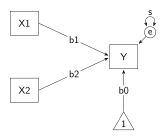
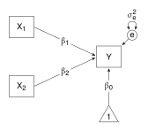
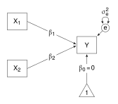

This section is concerned with typesetting mathematical symbols and Greek letters. Consider the multiple regression model below, in which Y is regressed on X1 and X2: b1 and b2 are the regression coefficients, b0 is the intercept, and s is the residual variance.  


```{tikz}
%| file: "Symbols1.tex"
```




The variable labels and the coefficients could use subscripts. In maths mode, subscripts are created using the undercore (`_`) character. For instance, to have the first variable's label appear as X~1~, replace the label `X1` (inside the curly brackets) with `X$_1$` or `$X_1$`. Superscripts are similarly created using the caret `^` symbol; for instance replace `s` with `s$^2$` in the variance's edge quote so that it appears as $\mathsf{s^{2}}$. 

However, there is a small problem: the maths mode font is different from the text font.  To get normal text and mathematical text appearing the same, I use the `mathastext` package. It is a LaTeX package, and is loaded with `\usepackage{mathastext}`, but it must follow `\renewcommand{\familydefault}{\sfdefault}` in the preamble. The two together instruct the compiler to use the current text font, which is now sans sarif, for letters and numbers in mathematical expressions.

Often, Greek letters are called for. For instance, to change b in the regression coefficients to $\mathsf{\upbeta}$, or to change s in the variance to $\mathsf{\upsigma}$, use the command for Greek letters, `\beta` and `\sigma` in maths mode: that is, replace `$b_1$` with `$\beta_1$`, replace `s$^2$` with `$\sigma^2_e$` - note that the superscript and the subscript together are rendered as $\mathsf{\upsigma^2_e}$.

There is another small problem - the Greek letters are slanted, like italics. There are a number of ways to get upright Greek letters. Here, I use the packages, `newpxtext` and `newpxmath`, which contain upright Greek letters for normal and mathematical text. These are LaTeX packages, and they are loaded with `\usepackage{newpxtext, newpxmath}` in the preamble. The commands for the two Greek letters used here are `\upbeta` and `\upsigma`. 

The additions to the preamble are:


```{tikz}
\usepackage{newpxtext,newpxmath}          % upright Greek

\renewcommand{\familydefault}{\sfdefault} % sans sarif
\usepackage{mathastext}                   % common look for maths and text
```


and examples of variable, regression, and variance label commands are:


```{tikz}
\node [manifest] (x1) {X$_1$};

\path [regression] (x1.0) edge ["$\upbeta_1$"] (y.177)

\path [variance = {right}{110}{6}] (e.60) edge ["$\upsigma^2_e$" {above = 2pt}] (e.120);
```


The preamble is getting long. However, the preamble remains constant across multiple diagrams, and thus it makes sense to move the preamble into its own file (called SEMstyles.tex), then have that file called by the scripts for different diagrams, using `\input{SEMstyles.tex}`. The SEMstyles.tex file looks like this (note that, now, the `tikz` package is loaded in SEMstyles.tex, whereas before it was loaded as an option in the `standalone` document class): 


```{tikz}
%| file: "SEMstyles.tex"
```


and then the script to draw the multiple regression diagram, with its call to SEMstyles.tex, looks like this:


```{tikz}
%| file: "Symbols2.tex"
```




Suppose I want to constrain the intercept to zero. An easy way to represent that in the path diagram is to replace the edge quote `$\upbeta_0$` with `$0$`. There are times though when I want to write it as an expression, $\mathsf{\upbeta_0}$ = 0, but it is often the case that in maths mode the spacing around the equal sign in too generous. I reduce the spacing to half using `\!`, and the edge quote becomes `$\upbeta_0 \! = \! 0$`.


```{tikz}
%| file: "Symbols4.tex"
```




```{r}
```
