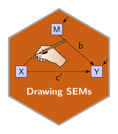
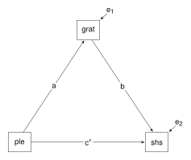
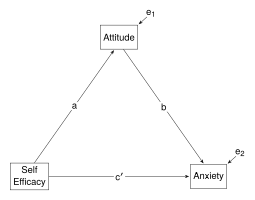
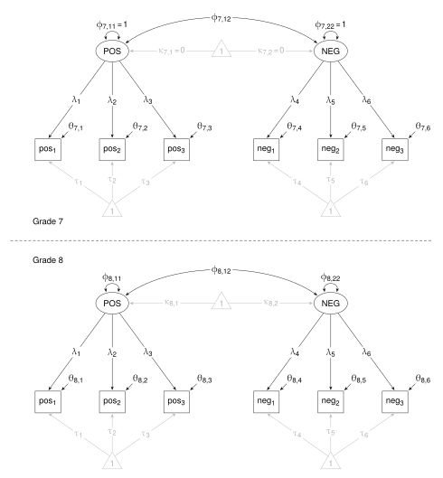
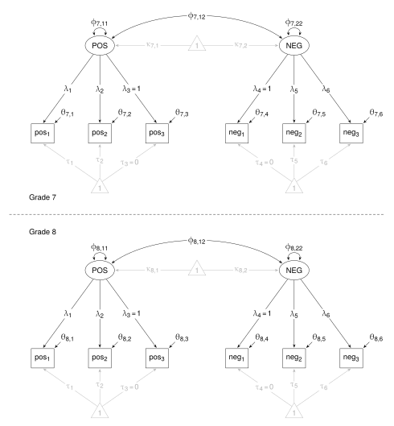
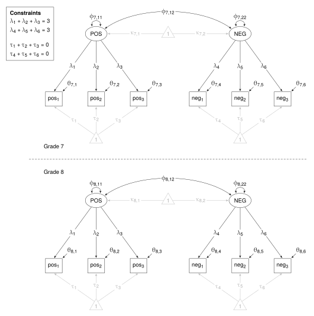
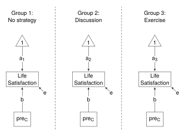
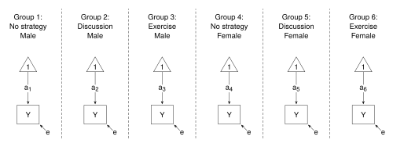

:::: {layout="[60, 40]" layout-valign="center"}

::: {#leftcolumn}
<h2 style = "margin: 0px;"> Drawing Structural Equation Models with Ti*k*Z </h2>
:::

::: {#rightcolumn}
  
:::

::::

This post presents **Ti*k*Z** scripts to draw the model path diagrams presented in this website.

I use the following **Ti*k*Z** libraries:

- positioning - positioning relative to a node
- quotes - labels as strings on paths
- calc - coordinate calculations
- math - simple mathematical operations
- arrows.meta - arrowhead shape
- bending - bendiness of curved paths
- shapes - triangle for constant
- backgrounds - pushing a path behind another path

and the following **LaTeX** packages:

- mathastext - use text font for math font
- amsmath - mathematical formulas
- newpxtext and newpxmath - upright Greek letters

There is a small set of symbols used in the diagrams. They are shown below.

{fig-align="left"}

These symbols, common to all the diagrams, are set up as styles in `SEMstyles.tex`, along with a call to the libraries and packages.


```{tikz}
%| code-summary: "Click to see SEMstyles.tex"
%| file: "SEMstyles.tex"
```    
</p>

All that is left for the individual **Ti*k*Z** scripts to do is to position the symbols on the canvas.

The scripts are rendered as pdf files, then converted to svg files using [inkscape](https://inkscape.org/).


#### The publications

- Jose, P. (2013). *Doing statistical mediation and moderation*. New York, NY: Guilford Press. <br/> 

<details>
  <summary>Mediation model diagram</summary>
    
</details> 

```{tikz}
%| code-summary: "Tikz code"
%| file: "Jose_2013/Jose_2013.tex"
```

<br/>

- Kurbanoglu, N. & Takunyaci, M. (2021). A structural equation modeling on relationship between self-efficacy, physics laboratory anxiety and attitudes. *Journal of Family, Counseling and Education*, 6(1), 47-56. <br/>

<details>
  <summary>Mediation model diagram</summary>
    
</details> 

```{tikz}
%| code-summary: "Tikz code"
%| file: "Kurbanoglu_2021/Kurbanoglu_2021.tex"
```  

<br/>
 
- Little, T., Slegers, D., & Card, N. (2006). A non-arbitrary method of identifying and scaling latent variables in SEM and MACS models. *Structural Equation Modeling*, *13*(1), 59-72. <br/> 

<details class="image-fold">
  <summary>Model diagram for Reference-Group Method</summary>
    
</details> 

```{tikz}
%| code-summary: "Tikz code"
%| file: "Little_2006/Scaling1.tex"
``` 

<p>

<details class="image-fold">
  <summary>Model diagram for Marker-Variable Method</summary>
    
</details>

```{tikz}
%| code-summary: "Tikz code"
%| file: "Little_2006/Scaling2.tex"
```  

<p>

<details class="image-fold">
  <summary>Model diagram for Effects-Scaling Method</summary>
    
</details> 

```{tikz}
%| code-summary: "Tikz code"
%| file: "Little_2006/Scaling3.tex"
```   

<br/> 

- Thompson, M., Liu, Y. & Green, S. (2023). Flexible structural equation modeling approaches for analyzing means. In R. Hoyle (Ed.), *Handbook of structural equation modeling* (2nd ed., pp. 385-408). New York, NY: Guilford Press. <br/>

<details>
  <summary>one-way ANOVA model diagram</summary>
    
</details> 

```{tikz}
%| code-summary: "Tikz code"
%| file: "Green_2023/one_way_ANOVA.tex"
```   

<p>

<details>
  <summary>one-way ANCOVA model diagram</summary>
    
</details> 

```{tikz}
%| code-summary: "Tikz code"
%| file: "Green_2023/one_way_ANCOVA.tex"
```

<p>

<details>
  <summary>two-way ANOVA model diagram</summary>
    
</details> 

```{tikz}
%| code-summary: "Tikz code"
%| file: "Green_2023/two_way_ANOVA.tex"
```

<p>

<details>
  <summary>one-way MANOVA model diagram</summary>
    
</details>

```{tikz}
%| code-summary: "Tikz code"
%| file: "Green_2023/one_way_MANOVA.tex"
```

<p>

<details>
  <summary>one-way LATENT model diagram</summary>
    
</details> 

```{tikz}
%| code-summary: "Tikz code"
%| file: "Green_2023/one_way_LATENT.tex"
```

```{r}
```