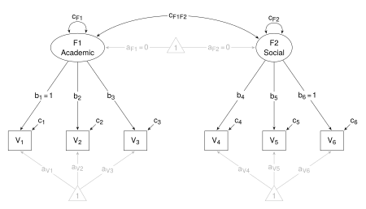
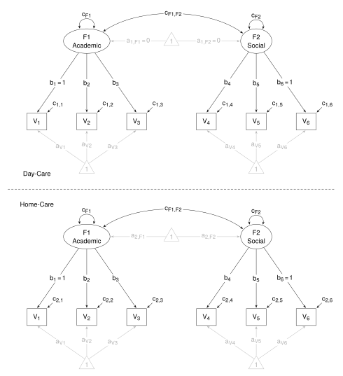

```{r echo = FALSE}
## Thompson, M. & Green, S. (2013). Evaluating between-group differences
## in latent variable means. In G. Hancock & R. Mueller (Eds.), *Structural
## equation modeling: A second course* (2nd ed., pp. 163-218). Charlotte, NC:
## Information Age Publishing.
```

Thompson, M. & Green, S. (2013). Evaluating between-group differences in latent variable means. In G. Hancock & R. Mueller (Eds.), *Structural equation modeling: A second course* (2nd ed., pp. 163-218). Charlotte, NC: Information Age Publishing.


This example shows Structured Means Modeling assuming strong invariance, but first, T&G present a one-group model to demonstrate the application of mean structure to latent variables. The path diagram in Fig 5.1 (p. 170) and reproduced below shows the model as it applies to the Day-care group. Academic and Social are the two constructs, and V~1~, ..., V~6~ are the indicators. In the path diagram, the gray lines represent the mean structure (ie, the means and intercepts).




#### Load relevant packages

First, load the **lavaan** package.

```{r echo = -1, eval = FALSE}
## Load package
library(lavaan)
```


#### Get the data

Summary data is presented in the upper part of Table 5.1 (p. 169). It gives the lower triangle of the co/variance matrix, means, and sample size for each group. The co/variances and means are entered as vectors, as they appear in the Table. Data for both groups are entered, but for the preliminary model, data for the Day-care group only will be used.

```{r echo = -1, eval = FALSE}
## Get data from Table 5.1
# Group 1 - Day-care
cov1 <- c(
 138.00,
  45.58,  80.49,
  35.19,  23.56,  56.34,
  45.13,  32.00,  16.64, 232.17,
  35.33,  10.49,  10.56,  79.74, 149.16,
  73.34,  28.73,  33.21, 117.30,  79.90, 324.36)

means1 <- c(50.40, 79.60, 98.88, 74.06, 49.12, 120.10)
n1 <- 200

# Group 2 - Home-care
cov2 <- c(
 127.61,
  58.49,  76.81,
  29.09,  19.72,  54.29,
  45.84,  28.94,  31.82, 223.09,
  20.33,  13.27,   5.81,  62.25, 135.72,
  50.64,  55.45,  30.15, 126.74,  62.16, 337.37)

means2 <- c(53.70, 81.32, 101.82, 77.69, 51.62, 123.37)
n2 <- 200
```

The variable names are also given in Table 5.1.

```{r echo = -1, eval = FALSE}
## Get the variable names from Table 5.1
names <- c("V1", "V2", "V3", "V4", "V5", "V6")
```

Combine the co/variances, means, and sample sizes into lists.

```{r echo = -1, eval = FALSE}
## Combine into lists
cov <- list("Day-care" = cov1, "Home-care" = cov2)
means <- list(means1, means2)
n <- list(n1, n2)
```

Use the `lav_getcov()` function from the **lavaan** package to obtain the full co/variance matrix for each group.

```{r echo = -1, eval = FALSE}
## Get the co/variance matrices
cov <- lapply(cov, lav_getcov, names = names)
```


### The single-group model

Some points to consider when constructing the model statement.

The model is fit to Group 1 (Day-care group) only.

For identification purposes, the first loading of the Academic construct and the third loading of the Social construct are constrained to one; and the latent means are constrained to zero.

This is not **lavaan**'s default.  The default constrains the first loading of all constructs to one. For the Social construct, the default has to be explicitely disabled by pre-multiplying the first loading by `NA`. (I constrain the first loading in the Academic construct to one. It's not necessary, but I do it to make it obvious that one loading in each construct is constrained to one.)

There is no need to be concerned about indicator residual variances and intercepts, nor construct variances and their covariance - **lavaan** will add them automatically. As well, there is no need to be concerned about setting the latent means to zero - **lavaan** will do that by default.

The model statement for the single-group model is quite brief.

```{r echo = c(-2,-1), eval = FALSE}

## The single-group model
model <- "
   # Measurement Model
   Academic =~ 1*V1 + V2 + V3
   Social =~ NA*V4 + V5 + 1*V6
"
```


#### Fit the model and get the results

The latent means that are constrained to zero by default will not appear in the output. To see them, set `remove.unused = FALSE` in the `summary()` function.

```{r echo = -2:-1, eval = FALSE}
## Fit the model and get the summary
#  Compare with Fig 5.1 (and fit measures on page 173)
m1_g1_fit <- sem(model, sample.cov = cov[[1]], sample.nobs = n[[1]],
   sample.mean = means[[1]])
summary(m1_g1_fit, fit.measures = TRUE, remove.unused = FALSE)
```

Compare with Fig 5.1 (and fit measures on page 173, end of first paragraph).


### The multi-group model

The multi-group model is shown in Fig 5.2 (p. 174), and is reproduced below.



Some points to consider:

This is a two-group model - Day-care and Home-care groups.

The model assumes strong invariance - loadings and intercepts are equal across groups. There is no need to be concerned about these constraints when constructing the model statement; they are set using `group.equal = c("loadings", "intercepts")` statement in the `sem()` function.

For purposes of identification, the first loading of the Academic construct and the third loading of the Social construct are constrained to one (also free Social's first loading so it can be estimated). With strong invariance, these constraints will apply in both groups. Also, latent means are set to zero in the first group only, but **lavaan** will deal with that automatically. Be aware that these means will not appear in the output. To see them, use `remove.unused = FALSE` in the `summary()` function. The model statement is the same as before, but is repeated here.

```{r echo = -2:-1, eval = FALSE}

## The two-group model
model <- "
   # Measurement Model
   Academic =~ 1*V1 + V2 + V3
   Social =~ NA*V4 + V5 + 1*V6
"
```


#### Fit the model and get the results

```{r echo = -2:-1, eval = FALSE}
## Fit the model and get the summary
#  Compare with Fig 5.2
m2_strong_fit <- sem(model, sample.cov = cov, sample.nobs = n, 
   sample.mean = means, group.equal = c("loadings", "intercepts"))
summary(m2_strong_fit, fit.measures = TRUE, remove.unused = FALSE)
```

Compare with Fig 5.2


#### Fit measures and comparing models

On page 176, T&G present fit measures for the model applied to each group. First, a function to extract fit measures is prepared; and then second, the fit measures used by T&G are selected.  Third, the model is fit to the second group (Home_care group); and then the two sets of fit measures are extracted. Compare these with the two sets of fit measures on page 176 - middle of the page.


```{r  echo = -1, eval = FALSE}

## A function to extract fit measure
GetFit <- function(fit, ...) {
   tab = fitMeasures(fit, ...)
   tab = round(tab, 3) 
   return(tab)
}

## Select measures
measures = c("chisq", "df", "pvalue", "cfi", "srmr", 
   "rmsea", "rmsea.ci.lower", "rmsea.ci.upper")

## Fit the model to Group 2
m1_g2_fit <- sem(model, sample.cov = cov[[2]], sample.nobs = n[[2]], 
   sample.mean = means[[2]])

# Get fit measures for group 1 and group 2 models
# Compare with fit measures on page 176
GetFit(m1_g1_fit, measures)
GetFit(m1_g2_fit, measures)
```

On pages 176 and 177, T&G are concerned with comparing the fit for a model assuming strong invariance with the fit for a model assuming configural invariance. Configural invariance requires only that the same model structure apply to both groups (ie, loadings and intercepts are not constrained to equality). The steps are: fit the model assuming configural invariance; get fit measures for configural invariance model and strong invariance model (compare with fit measures on pages 176 amd 177); apply the $\upchi$^2^ difference test (using the `anova()` function) to the two models (compare with results on page 177). 

```{r  echo = -2:-1, eval = FALSE}

## Comparing model assuming configural invariance with model assuming strong invariance
## Fit model assuming configural invariance 
m2_config_fit <- sem(model, sample.cov = cov, sample.nobs = n, sample.mean = means)

## Get fit measures for the two models
#  Compare with fit measures on page 176
GetFit(m2_config_fit, measures)
GetFit(m2_strong_fit, measures)

## Compare the two models
#  Compare with chi-square difference test on page 177
anova(m2_config_fit, m2_strong_fit)
```

Conclusion: The model assuming strong invariance is preferred. 


#### The means

Focus turns to the means. In the `m2_strong_fit` summary, the means for both constructs differ across the groups. Are those differences statistically significant? T&G obtain fit measures ($\upchi$^2^) for two models where the means are constrained to equality: first for the Academic construct; then for the Social construct. Following this, the fit for each of these models is compared in turn to the fit for the model with unequal means - `m2_strong_fit`.  Comparison is by means of the $\upchi$^2^ difference test using the `anova()` function. 

The steps are: 

  - First, write the model statements for the two modified models - in the first, the means for the Academic construct are constrained to be equal across the groups; in the second, the means for the Social construct are constrained to be equal across the groups;  
  - Second, fit the models;  
  - Third, get $\upchi$^2^ for each model (and compare with those at bottom of page 177);  
  - Fourth, compare the fit for each model with the fit for `m2_strong_fit` (compare the $\upchi$^2^ difference tests with those at the bottom of page 177).   

```{r  echo = -2:-1, eval = FALSE}

## Models constraining means to equality:
#    The Academic construct
Academic_equal <- "
   # Measurement Model
   Academic =~ 1*V1 + V2 + V3
   Social   =~ NA*V4 + V5 + 1*V6

   # Means
   Academic ~ c(0,0)*1
   Social   ~ c(0,NA)*1
"

#    The Social construct
Social_equal <- "
   # Measurement Model
   Academic =~ 1*V1 + V2 + V3
   Social   =~ NA*V4 + V5 + 1*V6

   # Means
   Academic ~ c(0,NA)*1
   Social   ~ c(0,0)*1
"

## Fit the models
Academic_equal_fit <- sem(Academic_equal, sample.cov = cov, sample.nobs = n,
     sample.mean = means, group.equal = c("loadings", "intercepts"))

Social_equal_fit <- sem(Social_equal, sample.cov = cov, sample.nobs = n,
     sample.mean = means, group.equal = c("loadings", "intercepts"))

## Get the fit measures
#  Compare with fit measures at bottom of page 177
measures = c("chisq", "df", "pvalue")
GetFit(Academic_equal_fit, measures)
GetFit(Social_equal_fit, measures)

## Compare fit for each model with m2_strong_fit
#  Compare with difference tests at bottom of page 177
anova(Academic_equal_fit, m2_strong_fit)
anova(Social_equal_fit, m2_strong_fit)
```

Conclusion: Means for both constructs differ across the groups.


#### Effect sizes

How big are those differences?

T&G assess effect sizes using standardised effect sizes. The formula is given at the bottom of page 178: for each construct, the effect size is given by the difference in the means divided by the square root of the variance. 

The relevant output is the one where the means differ - `m2_strong_fit`.

T&G label the first group, the Day-care group, as a reference group, and therfore, they use its variance as the variance in the effect size formula.

Get the effect sizes by copying the means and the variance from the `m2_strong_fit` summary.

```{r  echo = -3:-1, eval = FALSE}

## Get effect sizes (Day-care group as reference-group)
#  Compare with effect sizes of page 178
summary(m2_strong_fit, remove.unused = FALSE)
ES_Acad <- (3.566 - 0) / sqrt(73.69); ES_Acad
ES_Soc <- (3.885 - 0) / sqrt(141.75); ES_Soc
```

Compare with effect sizes given at the bottom of page 178.

If pooled variances are required, then, with equal group sizes, pooled variance is simply the average of the two variances.

```{r  echo = -1, eval = FALSE}
## Get effect sizes (pooled variance)
summary(m2_strong_fit)
ES_Acad <- (3.566 - 0) / sqrt((80.52 + 73.69)/2); ES_Acad
ES_Soc <- (3.885 - 0) / sqrt((133.43 + 141.75)/2); ES_Soc
```

However, copying is fraught with danger. It might be better to get R to extract the means and variances.

The `lavInspect()` function returns a list of estimates for model parameters. The latent means are in the "alpha" elements, and latent co/variances are in the "psi" elements. There are two sets of estimates, one for each group.

```{r  echo = -2:-1, eval = FALSE}

## Extract means and variances from fitted lavaan objects
#  Get estimates in a list
estimates <- lavInspect(m2_strong_fit, "est"); estimates
```

Select the means (using `[[` function), take their differences across groups, and ignore the sign (using `abs` function). I use the `lapply()` function to apply a function (`[[`) to select the two sets of means. I use the `Reduce()` function to reduce the two sets of means to one set by subtracting one group's means from the other group's means.

Similarly, select the co/variances (using `[[` function), select only the variances (using `diag()` function), and pool the variances by taking their average across the groups. Again, I use the `lapply()` function to apply a function (`[[`) to select the two sets of co/variances; then `lapply()` again to apply another function (`diag()`) to select just the variances. I use the `Reduce()` function to reduce the two sets of variances to one set by applying an averaging function. 

Finally, divide the differences in means by the square root of the pooled variance to get the effect sizes.

```{r  echo = -2:-1, eval = FALSE}

## Get effect sizes (pooled variance)
#  Get difference in means
means <- abs(Reduce('-', lapply(estimates, '[[', 'alpha'))); means

#  Get average of variances
var <- lapply(lapply(estimates, '[[', 'psi'), diag); var
pool <- Reduce(function(x,y) (x + y)/2, var); pool

#  Get effect sizes
ES <- means/sqrt(pool)
colnames(ES) <- "ES"
ES
``` 

To get the effect sizes using a reference group's variance (ie, T&G's effect sizes).

```{r  echo = -2:-1, eval = FALSE}

## Get effect sizes (reference group variance)
#  Get difference in means
means <- abs(Reduce('-', lapply(estimates, '[[', 'alpha'))); means

# Get the variances
var <- lapply(lapply(estimates, '[[', 'psi'), diag); var

# Effect size (1st group is reference group)
ES <- means / sqrt(var[[1]])
colnames(ES) <- "ES"
ES
```

Campare with the effect sizes given at the bottom of page 178.


<br>


```{r}
#| echo: false
#| include: false
#| eval: true
#| purl: false
input <- knitr::current_input()
output <- "R/Thompson1_2013.r"
knitr::purl(input, output, documentation = 0, quiet = TRUE)
xfun::gsub_file(output, "^# NA", "")
xfun::gsub_file(output, "^# ", "")
```

```{r}
#| echo: true
#| code-fold: true 
#| code-summary: "R code with minimal commenting"
#| file: !expr "noquote(output)"
```