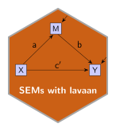

:::: {layout="[60, 40]" layout-valign="center"}

::: {#leftcolumn}
<h2 style = "margin: 0px;"> Replicate published Structural Equation Models with lavaan </h2>
:::

::: {#rightcolumn}
  
:::

::::

This section presents **R** scripts to replicate published Structural Equation Model analyses with **lavaan**.

#### The publications

::: {.no-indent}
- Jose, P. (2013). *Doing statistical mediation and moderation*. New York, NY: Guilford Press.  
[Mediation I:](Jose_2013/Jose_2013.qmd) A basic three-variable mediation analysis.

- Kurbanoglu, N. & Takunyaci, M. (2021). A structural equation modeling on relationship between self-efficacy, physics laboratory anxiety and attitudes. *Journal of Family, Counseling and Education*, *6*(1), 47-56.   
[Medition II:](Kurbanoglu_2021/Kurbanoglu_2021.qmd) A basic three-variable mediation analysis using summary data.

- Little, T., Slegers, D., & Card, N. (2006). A non-arbitrary method of identifying and scaling latent variables in SEM and MACS models. *Structural Equation Modeling*, *13*(1), 59-72.   
[Scaling:](Little_2006/Little_2006.qmd) Methods of scaling and identification in latent variable models.

- Thompson, M., Liu, Y. & Green, S. (2023). Flexible structural equation modeling approaches for analyzing means. In R. Hoyle (Ed.), *Handbook of structural equation modeling* (2nd ed., pp. 385-408). New York, NY: Guilford Press.  
[Means:](Green_2023/index.qmd) SEM approaches to ANOVA and MANOVA models.

- Thompson, M. & Green, S. (2013). Evaluating between-group differences in latent variable means. In G. Hancock & R. Mueller (Eds.), *Structural equation modeling: A second course* (2nd ed., pp. 163-218). Charlotte, NC: Information Age Publishing.  
Latent Means: Thompson_2013/index.qmd Assessing group differences in latent variable means.

- Berry, D., & Willoughby, M. (2016). On the practical interpretability of cross-lagged panel models: Rethinking a developmental workhorse. *Child Development*, *88*(4), 1186-1206.  
ALT-SR: Berry_2016/index.qmd Autoregressive latent trajectory model with structured residuals
:::

